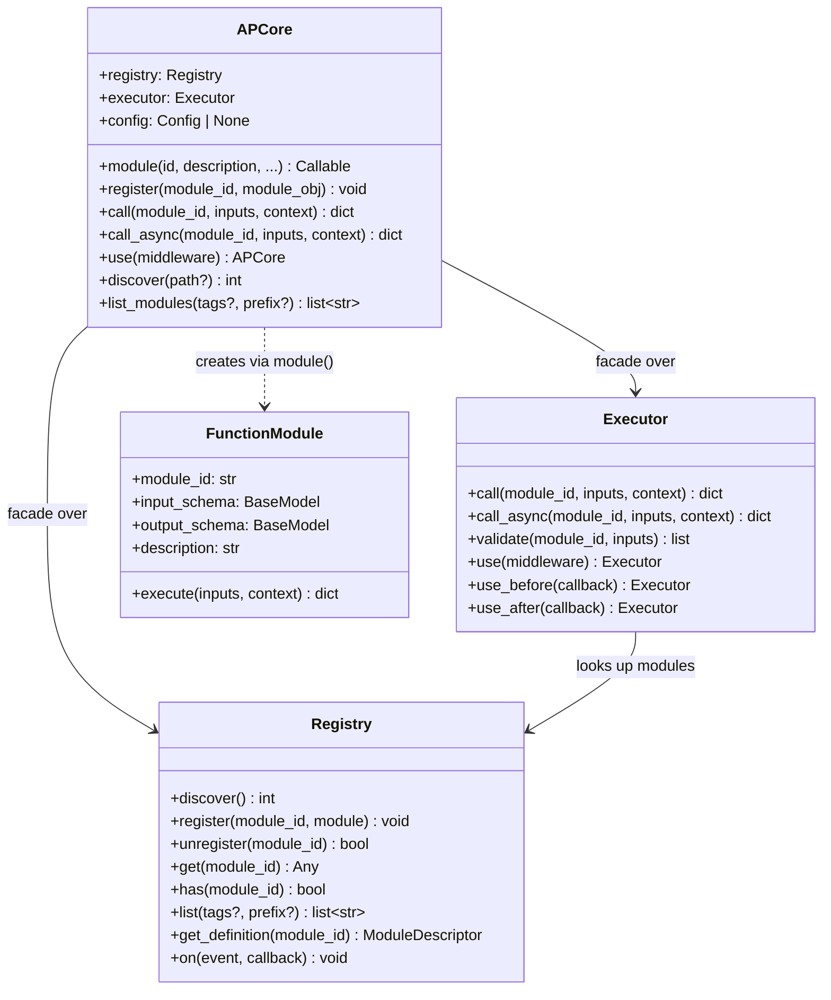
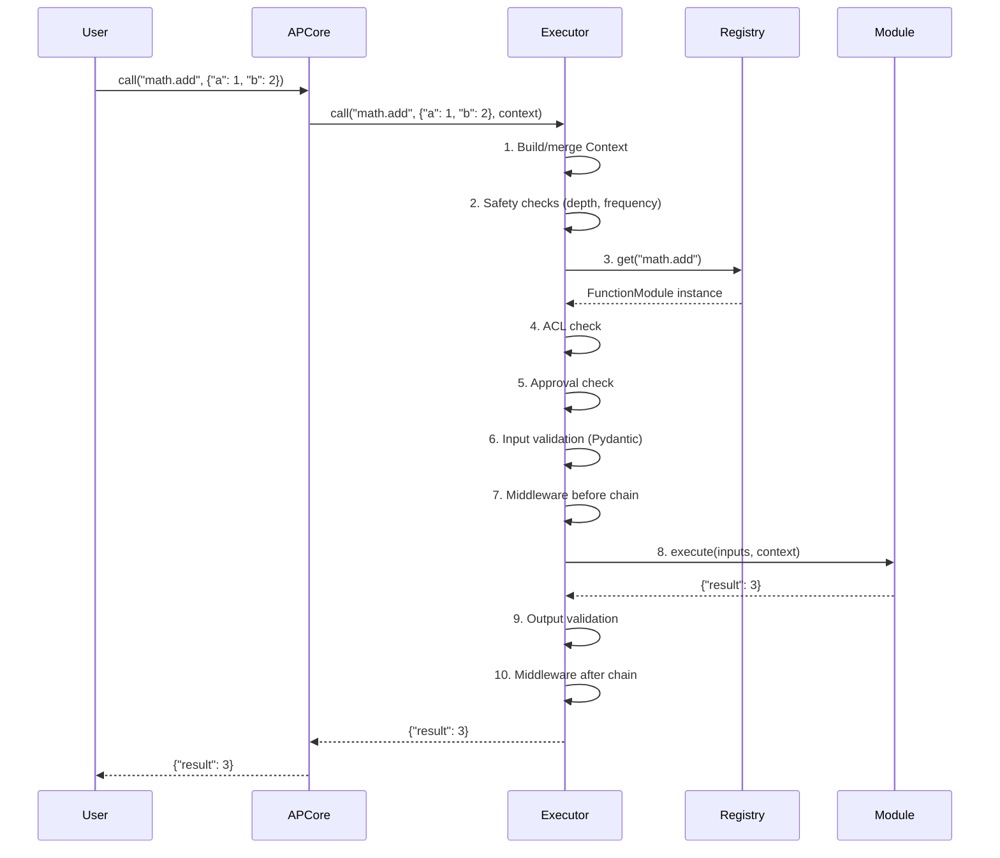

# Technical Design Document: APCore Unified Client Enhancement

| Field       | Value                                      |
|-------------|--------------------------------------------|
| **Author**  | Architecture Team                          |
| **Date**    | 2026-03-07                                 |
| **Status**  | Draft                                      |
| **Version** | 0.9.0 (apcore)                             |
| **SDKs**    | apcore-python (Python >=3.11, Pydantic 2.x), apcore-typescript (ESM, TypeBox) |

---

## 1. Overview

The APCore Unified Client Enhancement improves the developer experience for both the Python and TypeScript SDKs of `apcore`, a schema-driven module development framework for AI-perceivable interfaces. Today, beginners must understand and manually wire together `Registry` (module discovery and storage) and `Executor` (11-step execution pipeline) before they can register or call a single module. A high-level `APCore` client class was introduced in the Python SDK to address this, following the `client = OpenAI()` pattern, but it ships with a critical decorator bug, zero test coverage, missing convenience methods, and no TypeScript counterpart.

This design document specifies fixes and enhancements across six work items (P0 through P2): fixing the `@client.module()` decorator so it returns the original function, adding comprehensive unit tests, surfacing `discover()` and `list_modules()` as first-class client methods, creating a feature-equivalent `APCore` class in the TypeScript SDK, and evaluating result-unwrapping ergonomics. The goal is a thin, fully-tested Facade that lets a developer go from zero to executing modules in three lines of code, identically in both languages.

---

## 2. Goals / Non-Goals

### Goals

1. **Fix P0 decorator bug** -- `@client.module()` must return the original function, not a `FunctionModule` object.
2. **Achieve >=90% test coverage** on the `APCore` client class (currently 0%).
3. **Add `client.discover()`** -- proxy to `registry.discover()` so beginners never touch Registry directly.
4. **Add `client.list_modules()`** -- proxy to `registry.list()` for module discoverability.
5. **Create TypeScript `APCore` class** with identical public API surface.
6. **Evaluate result unwrapping** -- design an opt-in mechanism for unwrapping single-field `{"result": value}` returns.
7. **Maintain backward compatibility** -- no breaking changes to existing public API.

### Non-Goals

- Replacing Registry or Executor internals.
- Adding new execution pipeline steps.
- Implementing a plugin system for the client itself.
- Auto-generating TypeScript types from Python (cross-SDK codegen).
- Implementing result unwrapping in this phase (design only; implementation deferred to a follow-up).

---

## 3. Background

### Current Architecture

```
User Code
    |
    v
APCore (Facade) -----> Registry (module storage, discovery, events)
    |                       ^
    |                       |
    +---> Executor ---------+
          (11-step pipeline: context -> safety -> lookup -> ACL ->
           approval -> input validation -> middleware before ->
           execute -> output validation -> middleware after -> return)
```

**Registry** provides: `discover()`, `register()`, `unregister()`, `get()`, `list()`, `get_definition()`, `has()`, `on()`, event system, hot-reload.

**Executor** provides: `call()` / `call_async()` (Python) or `call()` (TS, async-only), `validate()`, `use()`, `use_before()`, `use_after()`.

### Pain Points

1. **Steep onboarding**: beginners must instantiate Registry, then Executor(registry=...), then call executor methods -- three objects before any useful work.
2. **Decorator bug (P0)**: `@client.module(id="x")` calls `decorator_module(func, id=id, ..., registry=self.registry)`. Because `func` is passed as the first positional arg AND `registry` is not None, the decorator's `_wrap()` is invoked with `return_module=True` (line 287 of `decorator.py`), returning a `FunctionModule` instead of the original function. This means `add(1, 2)` raises `TypeError` because `FunctionModule` is not callable as a plain function.
3. **No tests**: The `APCore` class in `client.py` has zero unit tests.
4. **Missing convenience methods**: `discover()` and `list_modules()` require direct Registry access.
5. **No TypeScript parity**: The TypeScript SDK exports Registry and Executor but has no unified client.

---

## 4. Detailed Design

### 4.1 P0: Fix `@client.module()` Decorator Return Value

#### Root Cause Analysis

In `decorator.py`, the `module()` function at line 283-287:

```python
if func_or_none is not None and callable(func_or_none):
    # Function call form: module(func, id="x")
    if id is not None or registry is not None:
        return _wrap(func_or_none, return_module=True)  # BUG: returns FunctionModule
    return _wrap(func_or_none, return_module=False)
```

When `client.module()` calls `decorator_module(func, id=id, ..., registry=self.registry)`, it passes `func` as the first positional argument. Because `registry is not None`, the code path hits `return_module=True`, returning the `FunctionModule` instead of the original function.

#### Solution

Change `client.py`'s `module()` method to NOT pass `func` as the first positional argument to `decorator_module`. Instead, call `decorator_module` with keyword-only arguments to get back a decorator, then apply it to `func`, and attach the `FunctionModule` as an attribute while returning the original function.

**Before (buggy):**

```python
# client.py, line 57-69
def decorator(func: Callable) -> Callable:
    return decorator_module(
        func,  # <-- passed as positional, triggers return_module=True
        id=id,
        description=description,
        ...
        registry=self.registry,
    )
```

**After (fixed):**

```python
# client.py, line 57-69
def decorator(func: Callable) -> Callable:
    # Call decorator_module WITHOUT func as positional arg.
    # This returns a decorator function (line 292-294 of decorator.py).
    inner_decorator = decorator_module(
        id=id,
        description=description,
        documentation=documentation,
        annotations=annotations,
        tags=tags,
        version=version,
        metadata=metadata,
        examples=examples,
        registry=self.registry,
    )
    # inner_decorator calls _wrap(func, return_module=False),
    # which returns func with func.apcore_module = FunctionModule(...)
    return inner_decorator(func)
```

This ensures the decorator path at line 292-294 is taken:

```python
def decorator(func: Callable) -> Callable:
    return _wrap(func, return_module=False)  # returns original func
```

The original function is returned with `func.apcore_module` attached, and the `FunctionModule` is still registered in the registry.

**Verification:**

```python
client = APCore()

@client.module(id="math.add")
def add(a: int, b: int) -> int:
    return a + b

# Before fix: add is FunctionModule, add(1, 2) raises TypeError
# After fix:  add is the original function, add(1, 2) == 3
assert add(1, 2) == 3
assert hasattr(add, 'apcore_module')
assert client.registry.has("math.add")
```

---

### 4.2 P0: Unit Tests for APCore Client

A comprehensive test suite will be created at `/Users/tercelyi/Workspace/aipartnerup/apcore-python/tests/test_client.py`.

Key test cases are enumerated in the Test Plan (Section 8).

---

### 4.3 P1: Add `client.discover()` Method

#### Design Decision

`discover()` should delegate to `self.registry.discover()` directly, using whatever extension roots were configured on the Registry (via constructor or config). An optional `path` parameter overrides the extension root for one-off discovery from a specific directory.

**Python signature:**

```python
def discover(self, path: str | None = None) -> int:
    """Discover modules from extension directories.

    Args:
        path: Optional path to scan. If None, uses configured extension roots.

    Returns:
        Number of modules discovered and registered.
    """
```

**Implementation:**

```python
def discover(self, path: str | None = None) -> int:
    if path is not None:
        # Create a temporary registry with the given path, discover, then merge
        temp_registry = Registry(extensions_dir=path, config=self.config)
        count = temp_registry.discover()
        # Re-register discovered modules into our registry
        for module_id, module_obj in temp_registry.iter():
            self.registry.register(module_id, module_obj)
        return count
    return self.registry.discover()
```

**Rationale for accepting `path`**: Beginners often have a single directory of modules they want to load. Requiring them to configure extension roots at construction time is an unnecessary barrier. The `path` parameter provides a quick "just scan this folder" escape hatch.

---

### 4.4 P1: TypeScript APCore Client

A new file `src/client.ts` in `apcore-typescript` will implement the `APCore` class mirroring the Python API, adapted to TypeScript idioms:

- TypeScript Executor has only `call()` (async), no `call_async()` -- so `APCore` exposes only `call()`.
- TypeScript Registry's `discover()` is async -- so `APCore.discover()` is async.
- TypeScript uses `Record<string, unknown>` instead of `dict[str, Any]`.

**TypeScript API:**

```typescript
export class APCore {
  readonly registry: Registry;
  readonly executor: Executor;

  constructor(options?: {
    registry?: Registry;
    executor?: Executor;
    config?: Config;
  });

  module(options: ModuleOptions): FunctionModule;
  register(moduleId: string, module: unknown): void;
  async call(moduleId: string, inputs?: Record<string, unknown>, context?: Context): Promise<Record<string, unknown>>;
  use(middleware: Middleware): APCore;
  async discover(path?: string): Promise<number>;
  listModules(options?: { tags?: string[]; prefix?: string }): string[];
}
```

Note: The TypeScript `module()` method does NOT use a decorator pattern (TypeScript decorators are stage 3 / experimental and have different semantics). Instead, it takes an options object and returns a `FunctionModule` directly. Users register functions by calling `client.module({ id: "math.add", ... })` as a function, not as a decorator.

---

### 4.5 P2: Add `client.list_modules()` Method

#### Design Decision

`list_modules()` returns a list of module ID strings (not full descriptors). This keeps the API simple and consistent with `registry.list()`. Users who need full descriptors can call `registry.get_definition(id)`.

**Python signature:**

```python
def list_modules(
    self,
    tags: list[str] | None = None,
    prefix: str | None = None,
) -> list[str]:
    """List registered module IDs.

    Args:
        tags: Filter to modules with all specified tags.
        prefix: Filter to modules whose ID starts with this prefix.

    Returns:
        Sorted list of module IDs.
    """
    return self.registry.list(tags=tags, prefix=prefix)
```

---

### 4.6 P2: Result Unwrapping (Design Only)

#### Problem

When a function returns a scalar (e.g., `int`), the output model wraps it as `{"result": 15}`. This is correct for the executor pipeline (which requires dict outputs for schema validation), but inconvenient for simple use cases.

#### Proposed Design (Deferred Implementation)

Add an opt-in `unwrap_result` parameter to `client.call()`:

```python
def call(
    self,
    module_id: str,
    inputs: dict[str, Any] | None = None,
    context: Context | None = None,
    *,
    unwrap_result: bool = False,
) -> Any:
    result = self.executor.call(module_id, inputs, context)
    if unwrap_result and list(result.keys()) == ["result"]:
        return result["result"]
    return result
```

**Why opt-in**: Changing the default return type would be a breaking change. Existing code expects `dict[str, Any]`. The `unwrap_result` flag gives users explicit control.

**Why deferred**: This changes the return type annotation (from `dict[str, Any]` to `Any`), which has type-safety implications. It needs further discussion on whether to use overloads or a separate method like `call_unwrapped()`.

---

### 4.7 API Surface Table

| Method | Python Signature | TypeScript Signature | Description |
|--------|-----------------|---------------------|-------------|
| `__init__` / `constructor` | `APCore(registry?, executor?, config?)` | `new APCore({ registry?, executor?, config? })` | Create client with optional injected components |
| `module` | `@client.module(id?, description?, ...)` | `client.module({ id, inputSchema, outputSchema, ... })` | Register a function as a module (decorator in Python, function call in TS) |
| `register` | `client.register(module_id, module_obj)` | `client.register(moduleId, module)` | Register a class-based module directly |
| `call` | `client.call(module_id, inputs?, context?)` -> `dict` | `client.call(moduleId, inputs?, context?)` -> `Promise<Record>` | Execute a module (sync in Python) |
| `call_async` | `await client.call_async(module_id, inputs?, context?)` -> `dict` | N/A (TS `call` is async) | Execute a module (async in Python) |
| `use` | `client.use(middleware)` -> `APCore` | `client.use(middleware)` -> `APCore` | Add middleware, chainable |
| `discover` | `client.discover(path?)` -> `int` | `await client.discover(path?)` -> `Promise<number>` | Discover modules from extension dirs |
| `list_modules` | `client.list_modules(tags?, prefix?)` -> `list[str]` | `client.listModules({ tags?, prefix? })` -> `string[]` | List registered module IDs |

---

### 4.8 Class Diagram



### 4.9 Sequence Diagram: `client.call()` Flow



---

## 5. Alternatives Considered

### Alternative A: Subclass Executor Instead of Facade

Make `APCore` extend `Executor` directly, adding Registry management as inherited behavior.

| Criterion | Facade (chosen) | Subclass Executor |
|-----------|-----------------|-------------------|
| Separation of concerns | Clean -- APCore has no pipeline logic | Blurred -- APCore IS an Executor |
| Breaking changes | None -- new class, additive | Potential -- changes Executor hierarchy |
| Testability | Easy to mock Registry/Executor | Harder -- must test full pipeline |
| API clarity | Explicit delegation | Implicit inheritance |
| Flexibility | Can swap Registry/Executor impls | Locked to Executor class |

**Verdict**: Facade is preferred. The client is explicitly a convenience wrapper, not a new execution concept.

### Alternative B: Global Functions Only (No Class)

Instead of an `APCore` class, expose only module-level convenience functions (`call()`, `module()`, `discover()`, etc.) backed by a hidden singleton.

| Criterion | APCore class (chosen) | Global functions only |
|-----------|----------------------|----------------------|
| Multiple client instances | Supported | Not supported |
| Dependency injection | Natural (constructor) | Awkward (setter functions) |
| Discoverability | IDE autocomplete on instance | Must know function names |
| Testing | Easy to isolate | Global state makes tests fragile |
| Beginner simplicity | Very simple (`client.call()`) | Slightly simpler (`apcore.call()`) |

**Verdict**: APCore class is preferred. Global convenience functions are still provided (backed by a default APCore instance), so both patterns are supported.

### Alternative C: Fix Decorator by Modifying `decorator.py` Instead of `client.py`

Change the `module()` function in `decorator.py` to never return `FunctionModule` when `registry` is provided.

| Criterion | Fix in client.py (chosen) | Fix in decorator.py |
|-----------|--------------------------|-------------------|
| Scope of change | Minimal -- 1 method in client.py | Broader -- affects all callers of decorator_module |
| Backward compat | No risk | Risk -- direct callers of `module(func, id=..., registry=...)` may depend on getting FunctionModule back |
| Clarity | Client controls its own contract | Decorator contract changes |

**Verdict**: Fix in `client.py` is safer. The decorator's `return_module=True` behavior is intentionally used by `module(func, id="x")` function-call form. Only the client's decorator usage is wrong.

---

## 6. Migration / Backward Compatibility

### What Changes

| Item | Change | Breaking? |
|------|--------|-----------|
| `@client.module()` return value | Returns original function instead of FunctionModule | **Bug fix** -- existing code using it was broken anyway |
| `client.discover()` | New method added | No -- additive |
| `client.list_modules()` | New method added | No -- additive |
| TypeScript `APCore` class | New export | No -- additive |
| TypeScript `index.ts` | New export `APCore` added | No -- additive |

### What Does NOT Change

- `Registry` API (all methods, signatures, behavior)
- `Executor` API (all methods, signatures, behavior)
- `@module` decorator (standalone, not via client)
- Global convenience functions in `__init__.py` (they use the default client, which gets the fix automatically)
- Any module's `execute()` contract
- The 11-step pipeline
- Middleware system

### Migration Guide

No migration required. All changes are additive or bug fixes. Users who were working around the decorator bug (e.g., using `client.register()` instead of `@client.module()`) can now use the decorator as intended.

---

## 7. Test Plan

### Python Test Suite: `tests/test_client.py`

| Test Function | Verifies |
|--------------|----------|
| `test_default_construction` | APCore() creates Registry and Executor internally |
| `test_custom_registry_executor` | APCore(registry=r, executor=e) uses provided instances |
| `test_module_decorator_returns_function` | `@client.module()` returns original callable function |
| `test_module_decorator_registers_in_registry` | Decorated function is findable via `registry.has()` |
| `test_module_decorator_preserves_function_behavior` | `add(1, 2) == 3` after decoration |
| `test_module_decorator_attaches_apcore_module` | `func.apcore_module` is a FunctionModule instance |
| `test_module_decorator_auto_id` | Omitting `id=` generates an auto ID |
| `test_module_decorator_custom_metadata` | description, tags, version are set correctly |
| `test_register_class_module` | `client.register("id", module)` works for class-based modules |
| `test_call_sync` | `client.call("math.add", {"a": 1, "b": 2})` returns `{"result": 3}` |
| `test_call_async` | `await client.call_async(...)` returns correct result |
| `test_call_module_not_found` | `client.call("nonexistent")` raises ModuleNotFoundError |
| `test_use_middleware_chaining` | `client.use(m1).use(m2)` returns self and both middlewares fire |
| `test_discover_delegates_to_registry` | `client.discover()` calls `registry.discover()` |
| `test_discover_with_path` | `client.discover("/some/path")` scans that specific directory |
| `test_list_modules_empty` | `client.list_modules()` returns `[]` when nothing registered |
| `test_list_modules_with_entries` | Returns sorted list of registered module IDs |
| `test_list_modules_filter_tags` | Filters by tags correctly |
| `test_list_modules_filter_prefix` | Filters by prefix correctly |

### TypeScript Test Suite: `tests/test-client.test.ts`

Mirrors the Python test suite with TypeScript/vitest idioms:

| Test Case | Verifies |
|-----------|----------|
| `creates default registry and executor` | Constructor defaults |
| `accepts custom registry and executor` | Dependency injection |
| `module() returns FunctionModule` | Registration works (TS has no decorator pattern) |
| `register() adds module to registry` | Direct registration |
| `call() executes module` | End-to-end call |
| `call() throws on unknown module` | Error handling |
| `use() chains middleware` | Middleware chaining |
| `discover() delegates to registry` | Discovery proxy |
| `listModules() returns sorted IDs` | Listing proxy |
| `listModules() filters by tags` | Tag filtering |
| `listModules() filters by prefix` | Prefix filtering |

---

## 8. Implementation Plan

### Phase 1: Fix and Test (P0) -- Estimated: 1-2 days

| Step | Task | Dependencies | Files |
|------|------|-------------|-------|
| 1.1 | Fix `@client.module()` decorator bug | None | `src/apcore/client.py` |
| 1.2 | Write comprehensive unit tests | 1.1 | `tests/test_client.py` |
| 1.3 | Verify fix with global convenience functions | 1.1 | `src/apcore/__init__.py` (read-only verification) |
| 1.4 | Run ruff, mypy, pytest; ensure zero errors | 1.2 | -- |

### Phase 2: Convenience Methods (P1) -- Estimated: 1 day

| Step | Task | Dependencies | Files |
|------|------|-------------|-------|
| 2.1 | Add `discover(path?)` method to APCore | 1.1 | `src/apcore/client.py` |
| 2.2 | Add `list_modules(tags?, prefix?)` method | 1.1 | `src/apcore/client.py` |
| 2.3 | Add tests for discover and list_modules | 2.1, 2.2 | `tests/test_client.py` |
| 2.4 | Update `__init__.py` to expose global `discover()` and `list_modules()` | 2.1, 2.2 | `src/apcore/__init__.py` |

### Phase 3: TypeScript Parity (P1) -- Estimated: 2-3 days

| Step | Task | Dependencies | Files |
|------|------|-------------|-------|
| 3.1 | Create `APCore` class in TypeScript | None (can parallel Phase 1-2) | `src/client.ts` |
| 3.2 | Export `APCore` from `index.ts` | 3.1 | `src/index.ts` |
| 3.3 | Write vitest test suite | 3.1 | `tests/test-client.test.ts` |
| 3.4 | Run tsc --noEmit, vitest | 3.3 | -- |

### Phase 4: Result Unwrapping Design Review (P2) -- Estimated: 0.5 day

| Step | Task | Dependencies | Files |
|------|------|-------------|-------|
| 4.1 | Review proposed `unwrap_result` API with team | Phase 1 complete | -- |
| 4.2 | If approved, create follow-up feature spec | 4.1 | `docs/features/result-unwrapping.md` |

### Dependency Graph

```
Phase 1 (P0: Fix + Tests)
    |
    v
Phase 2 (P1: discover + list_modules)
    |
    +---> Phase 4 (P2: Result unwrap design)

Phase 3 (P1: TypeScript) -- can run in parallel with Phase 1-2
```

---

## Appendix A: File Inventory

### Python SDK (`apcore-python/`)

| File | Role |
|------|------|
| `src/apcore/client.py` | APCore facade class (modify) |
| `src/apcore/__init__.py` | Global convenience functions, exports (modify) |
| `src/apcore/decorator.py` | `@module` decorator, FunctionModule (read-only) |
| `src/apcore/registry/registry.py` | Registry class (read-only) |
| `src/apcore/executor.py` | Executor class (read-only) |
| `tests/test_client.py` | New test suite (create) |

### TypeScript SDK (`apcore-typescript/`)

| File | Role |
|------|------|
| `src/client.ts` | APCore facade class (create) |
| `src/index.ts` | Public exports (modify) |
| `src/decorator.ts` | `module()` function, FunctionModule (read-only) |
| `src/registry/registry.ts` | Registry class (read-only) |
| `src/executor.ts` | Executor class (read-only) |
| `tests/test-client.test.ts` | New test suite (create) |
