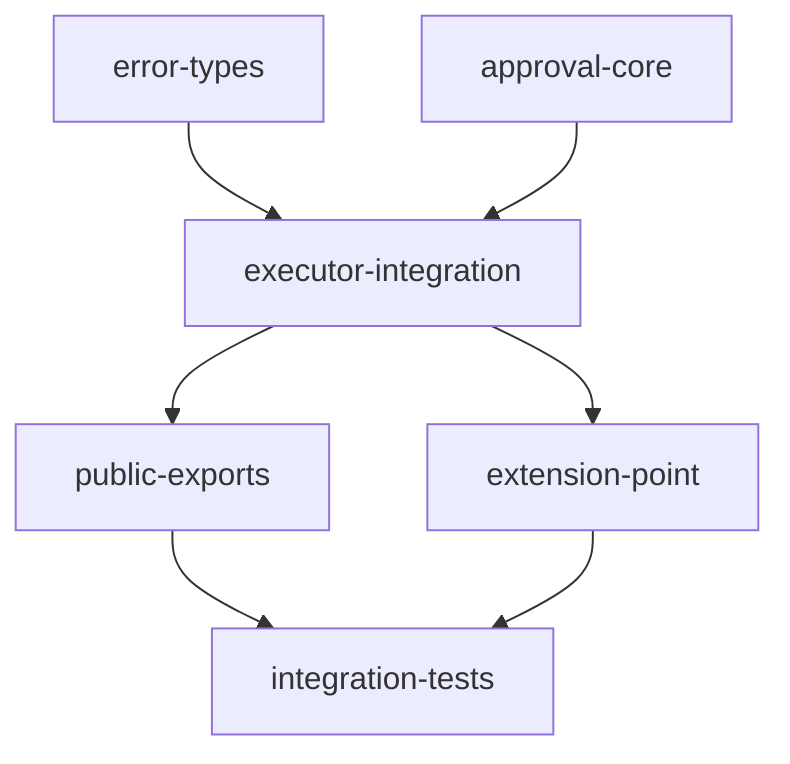

# Implementation Plan: Approval System

## Goal

Implement a runtime approval gate at Executor Step 4.5 (after ACL, before Input Validation) that enforces the `requires_approval` annotation. Supports synchronous blocking approval (Phase A) and asynchronous pending-then-resume approval (Phase B) through an `ApprovalHandler` protocol.

## Architecture Design

### Component Structure

The approval system spans four source files with six logical components:

- **`ApprovalHandler`** (`approval.py`) -- Runtime-checkable Protocol defining two async methods: `request_approval(request) -> ApprovalResult` and `check_approval(approval_id) -> ApprovalResult`. Handlers implement this protocol to provide custom approval logic.

- **`ApprovalRequest` / `ApprovalResult`** (`approval.py`) -- Frozen dataclasses. Request carries module_id, arguments, context, annotations, description, and tags. Result carries status ("approved"/"rejected"/"timeout"/"pending"), approved_by, reason, approval_id, and metadata.

- **Built-in Handlers** (`approval.py`) -- `AlwaysDenyHandler` (always rejects), `AutoApproveHandler` (always approves), `CallbackApprovalHandler` (delegates to an async callback function).

- **Approval Errors** (`errors.py`) -- `ApprovalError(ModuleError)` base with `ApprovalDeniedError`, `ApprovalTimeoutError`, `ApprovalPendingError`. Three new error codes: `APPROVAL_DENIED`, `APPROVAL_TIMEOUT`, `APPROVAL_PENDING`.

- **Executor Gate** (`executor.py`) -- Step 4.5 inserted between ACL (Step 4) and Input Validation (Step 5). Private helpers: `_needs_approval()`, `_build_approval_request()`, `_handle_approval_result()`, `_check_approval_sync()`, `_check_approval_async()`.

- **Extension Point** (`extensions.py`) -- `approval_handler` registered as a non-multiple built-in extension point. Wired via `executor.set_approval_handler()` in `apply()`.

### Data Flow

```
Executor.call() / call_async() / stream()
  |
  +--> Step 4: ACL check
  |
  +--> Step 4.5: Approval Gate
  |      1. _needs_approval(module) -> bool
  |         - Check annotations (ModuleAnnotations or dict form)
  |         - Return requires_approval value
  |      2. If _approval_token in arguments:
  |         - Pop token, call handler.check_approval(token)  [Phase B resume]
  |      3. Else:
  |         - Build ApprovalRequest from module + context
  |         - Call handler.request_approval(request)          [Phase A]
  |      4. _handle_approval_result(result):
  |         - "approved" -> continue
  |         - "rejected" -> raise ApprovalDeniedError
  |         - "timeout"  -> raise ApprovalTimeoutError
  |         - "pending"  -> raise ApprovalPendingError (with approval_id)
  |         - unknown    -> log warning, raise ApprovalDeniedError
  |
  +--> Step 5: Input Validation
```

### Technical Choices

- **Optional handler (None default)**: When no handler is configured, the gate is completely skipped. This ensures 100% backward compatibility with existing code.
- **Dual annotation forms**: Both `ModuleAnnotations` dataclass and raw `dict` are supported via `isinstance` checks, since modules may use either form.
- **Sync/async bridging**: The sync `call()` path uses `_run_async_in_sync()` to invoke async handler methods, consistent with existing executor patterns.
- **`dataclasses.fields()` for annotation conversion**: When annotations are a `dict`, only fields that exist on `ModuleAnnotations` are extracted, preventing unexpected keyword arguments.
- **Unknown status defense**: Unrecognized status values trigger a `_logger.warning` and fall through to `ApprovalDeniedError` (fail-closed).

## Task Breakdown



| Task ID | Title | Estimated Time | Dependencies |
|---------|-------|---------------|--------------|
| error-types | Approval error classes and error codes | 0.5h | none |
| approval-core | ApprovalHandler protocol, data types, built-in handlers | 1h | none |
| executor-integration | Approval gate at Step 4.5 in call/call_async/stream | 3h | error-types, approval-core |
| public-exports | Export new types from __init__.py | 0.5h | executor-integration |
| extension-point | approval_handler extension point in ExtensionManager | 1h | executor-integration |
| integration-tests | End-to-end tests through full executor pipeline | 2h | public-exports, extension-point |

## Risks and Considerations

- **Circular import avoidance**: `errors.py` cannot import `ApprovalResult` from `approval.py` (both imported by `executor.py`), so `ApprovalError.result` is typed as `Any`. Documented as acceptable tradeoff.
- **Sync handler in sync context**: Async handlers called from sync `call()` use the existing `_run_async_in_sync()` bridge with `timeout_ms=0` (handler manages its own timeout).
- **Annotation form divergence**: The dual-form handling adds complexity but is necessary since the codebase supports both patterns.

## Acceptance Criteria

- [x] `ApprovalHandler` protocol with `request_approval()` and `check_approval()` async methods
- [x] `ApprovalRequest` and `ApprovalResult` frozen dataclasses with correct fields
- [x] Three built-in handlers: `AlwaysDenyHandler`, `AutoApproveHandler`, `CallbackApprovalHandler`
- [x] Error hierarchy: `ApprovalError` base with three specific subclasses and error codes
- [x] Step 4.5 gate in `call()`, `call_async()`, and `stream()` with correct ordering
- [x] Dual annotation form support (dataclass and dict)
- [x] Phase B `_approval_token` pop-and-resume flow
- [x] `approval_handler` extension point wired in `ExtensionManager.apply()`
- [x] Audit events emitted: `logging.info` for all decisions + span event when tracing active (Level 3 conformance)
- [x] All 1180 tests pass (1114 existing + 66 new) with zero ruff/black/pyright warnings
- [x] Full backward compatibility: no handler = gate skipped

## References

- Source: `src/apcore/approval.py`, `src/apcore/errors.py`, `src/apcore/executor.py`, `src/apcore/extensions.py`
- Tests: `tests/test_approval.py`, `tests/test_approval_executor.py`, `tests/test_approval_integration.py`
- Feature spec: [approval-system.md](../../docs/features/approval-system.md)
