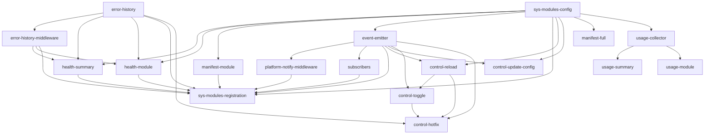

# sys-modules - Implementation Overview

## Progress

```
[                                        ] 0/21 tasks (0%)
```

| Status | Count |
|--------|-------|
| Completed | 0 |
| In Progress | 0 |
| Pending | 21 |

## Task Overview

### Phase 1: P0 Foundation (~2 weeks)

| # | Task | Description | Status | PRD |
|---|------|-------------|--------|-----|
| 1 | [error-history](./tasks/error-history.md) | ErrorHistory ring buffer with deduplication | pending | F1 |
| 2 | [error-history-middleware](./tasks/error-history-middleware.md) | ErrorHistoryMiddleware recording ModuleError details | pending | F2 |
| 3 | [sys-modules-config](./tasks/sys-modules-config.md) | Config extensions for sys_modules and project metadata | pending | F6 |
| 4 | [event-emitter](./tasks/event-emitter.md) | EventEmitter global event bus | pending | F7 |
| 5 | [platform-notify-middleware](./tasks/platform-notify-middleware.md) | PlatformNotifyMiddleware threshold sensor | pending | F8 |
| 6 | [subscribers](./tasks/subscribers.md) | WebhookSubscriber and A2ASubscriber | pending | F9 |
| 7 | [health-summary](./tasks/health-summary.md) | system.health.summary module | pending | F3 |
| 8 | [health-module](./tasks/health-module.md) | system.health.module with recent_errors | pending | F4 |
| 9 | [manifest-module](./tasks/manifest-module.md) | system.manifest.module with source_path | pending | F5 |
| 10 | [sys-modules-registration](./tasks/sys-modules-registration.md) | Auto-registration wiring | pending | F1-F9 |

### Phase 2: P1 Control + Usage (~2 weeks)

| # | Task | Description | Status | PRD |
|---|------|-------------|--------|-----|
| 11 | [control-reload](./tasks/control-reload.md) | system.control.reload_module | pending | F10 |
| 12 | [control-update-config](./tasks/control-update-config.md) | system.control.update_config | pending | F11 |
| 13 | [manifest-full](./tasks/manifest-full.md) | system.manifest.full with filtering | pending | F12 |
| 14 | [usage-collector](./tasks/usage-collector.md) | UsageCollector + UsageMiddleware | pending | F13 |
| 15 | [usage-summary](./tasks/usage-summary.md) | system.usage.summary | pending | F14 |
| 16 | [usage-module](./tasks/usage-module.md) | system.usage.module | pending | F15 |
| 17 | [spec-adjustments](./tasks/spec-adjustments.md) | 5 specification adjustments | pending | F16 |

### Phase 3: P2 Protocol + Advanced Control (parallel with apevo)

| # | Task | Description | Status | PRD |
|---|------|-------------|--------|-----|
| 18 | [streaming-protocol](./tasks/streaming-protocol.md) | Streaming protocol formalization | pending | F17 |
| 19 | [version-negotiation](./tasks/version-negotiation.md) | Module version negotiation | pending | F18 |
| 20 | [control-toggle](./tasks/control-toggle.md) | system.control.toggle_feature | pending | F19 |
| 21 | [control-hotfix](./tasks/control-hotfix.md) | system.control.apply_hotfix | pending | F20 |

## Dependencies


