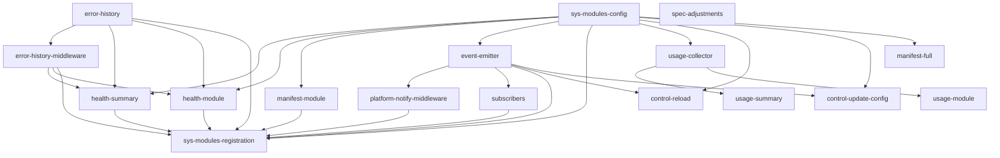

# Implementation Plan: System Modules (sys.*)

## Goal

Add 20 new features to apcore that enable the AI self-evolution ecosystem: health sensing (Pull), event push (Push), control plane (Control), and usage analytics (Feedback). All features are opt-in via `sys_modules.enabled` config with zero overhead when disabled.

## Source Documents

- PRD: `docs/apcore-improvements/prd.md` (in aiperceivable-docs repo)
- Feature Analysis: `docs/5-plans/apcore-new-features-comprehensive.md` (in aiperceivable-docs repo)
- Design Review: `docs/2-research/architecture/apcore-ai-era-design-review.md` (in aiperceivable-docs repo)

## Architecture Design

### Component Structure

The system modules feature set is organized into 7 groups across 3 phases:

**Phase 1: P0 Foundation (~2 weeks, 9 features)**

Group A — Infrastructure (F1, F2, F6):
- `ErrorHistory` (`observability/error_history.py`) — Thread-safe ring buffer storing recent error details per module with deduplication
- `ErrorHistoryMiddleware` (`middleware/error_history.py`) — Records ModuleError details into ErrorHistory on every on_error()
- `sys_modules` Config Extension (`config.py`) — New config sections: project.source_repo, project.source_root, sys_modules.*

Group B — Health Perception (F3, F4):
- `system.health.summary` (`sys_modules/health.py`) — Overview of all modules: status, error_rate, top_error with ai_guidance
- `system.health.module` (`sys_modules/health.py`) — Detailed health for one module: recent_errors array with ai_guidance, p99 latency

Group C — Manifest Introspection (F5):
- `system.manifest.module` (`sys_modules/manifest.py`) — Module manifest: Schema, annotations, source_path, metadata

Group D — Event System (F7, F8, F9):
- `EventEmitter` (`events/emitter.py`) — Global event bus with EventSubscriber protocol, async fan-out, error isolation
- `PlatformNotifyMiddleware` (`middleware/platform_notify.py`) — Threshold sensor: emits error_threshold_exceeded, latency_threshold_exceeded events
- `WebhookSubscriber` + `A2ASubscriber` (`events/subscribers.py`) — HTTP and A2A event delivery mechanisms

**Phase 2: P1 Control + Usage (~2 weeks, 7 features)**

Group E — Control Plane (F10, F11):
- `system.control.reload_module` (`sys_modules/control.py`) — Hot-reload via safe_unregister + re-discover
- `system.control.update_config` (`sys_modules/control.py`) — Runtime config update with validation and event emission

Group F — Usage Analytics (F13, F14, F15):
- `UsageCollector` + `UsageMiddleware` (`observability/usage.py`) — Time-windowed per-call usage tracking with caller identity and trend analysis
- `system.usage.summary` (`sys_modules/usage.py`) — All modules usage overview with trend detection
- `system.usage.module` (`sys_modules/usage.py`) — Single module detailed usage: per-caller breakdown, hourly distribution

Group G — Manifest Full + Spec (F12, F16):
- `system.manifest.full` (`sys_modules/manifest.py`) — Complete system manifest with filtering
- Specification Adjustments (5 items) — Documentation-only changes to PROTOCOL_SPEC

**Phase 3: P2 Protocol + Advanced Control (parallel with apevo, 4 features)**

Group H — Protocol (F17, F18):
- Streaming Protocol Formalization — PROTOCOL_SPEC new section
- Module Version Negotiation — version field, version_hint routing

Group I — Advanced Control (F19, F20):
- `system.control.toggle_feature` — Disable/enable modules without unloading
- `system.control.apply_hotfix` — Runtime patching with sandbox validation + rollback

### New Directory Structure

```
src/apcore/
├── events/                    # NEW — Event system
│   ├── __init__.py
│   ├── emitter.py            # EventEmitter, ApCoreEvent, EventSubscriber
│   └── subscribers.py        # WebhookSubscriber, A2ASubscriber
├── sys_modules/              # NEW — System modules
│   ├── __init__.py
│   ├── health.py             # system.health.summary, system.health.module
│   ├── manifest.py           # system.manifest.module, system.manifest.full
│   ├── control.py            # system.control.reload_module, system.control.update_config, toggle_feature, apply_hotfix
│   ├── usage.py              # system.usage.summary, system.usage.module
│   └── registration.py       # Auto-registration logic for sys.* modules + middleware
├── middleware/
│   ├── error_history.py      # NEW — ErrorHistoryMiddleware
│   └── platform_notify.py    # NEW — PlatformNotifyMiddleware
├── observability/
│   ├── error_history.py      # NEW — ErrorHistory component
│   └── usage.py              # NEW — UsageCollector + UsageMiddleware
└── config.py                 # MODIFIED — Add sys_modules config section
```

### Data Flow

```
Module call enters middleware pipeline:

MetricsMiddleware.before() -- push start time (existing)
  ErrorHistoryMiddleware.on_error() [F2] -- record error details to ErrorHistory
  UsageMiddleware.after()/on_error() [F13] -- record usage to UsageCollector
  PlatformNotifyMiddleware.on_error()/after() [F8] -- check thresholds
    -> If exceeded: EventEmitter.emit() [F7]
      -> WebhookSubscriber [F9] -- HTTP POST to external platform
      -> A2ASubscriber [F9] -- A2A message to apevo
MetricsMiddleware.after() -- record count (existing)

apevo polls:
  -> executor.call("system.health.summary") [F3]
     reads MetricsCollector + ErrorHistory
  -> executor.call("system.health.module", {"module_id": "payment.charge"}) [F4]
     returns recent_errors with ai_guidance
  -> executor.call("system.manifest.module", {"module_id": "payment.charge"}) [F5]
     returns source_path, Schema, annotations

apevo controls:
  -> executor.call("system.control.reload_module", {"module_id": "...", "reason": "..."}) [F10]
     safe_unregister -> re-discover -> re-register
```

### Auto-Activation Design

Current apcore has no built-in middleware auto-activation. All middleware requires explicit `executor.use()`.

New design: `sys_modules/registration.py` provides `register_sys_modules(registry, executor, config)`:
1. If `sys_modules.enabled=false` → return immediately (zero overhead)
2. Create ErrorHistory from config
3. Register ErrorHistoryMiddleware
4. Register sys.health.*, sys.manifest.module
5. If `sys_modules.events.enabled=true`:
   - Create EventEmitter
   - Register PlatformNotifyMiddleware
   - Instantiate configured subscribers
   - Bridge Registry events to EventEmitter

The APCore client (`client.py`) calls `register_sys_modules()` during initialization.

## Task Breakdown



### Execution Order (27 tasks)

**Phase 1: P0 Foundation**

| # | Task ID | Title | Depends On | PRD Feature |
|---|---------|-------|------------|-------------|
| 1 | error-history | ErrorHistory ring buffer with deduplication | — | F1 |
| 2 | error-history-middleware | ErrorHistoryMiddleware recording ModuleError details | error-history | F2 |
| 3 | sys-modules-config | Config extensions: project.source_repo/root, sys_modules.* | — | F6 |
| 4 | event-emitter | EventEmitter global event bus with ApCoreEvent and EventSubscriber | sys-modules-config | F7 |
| 5 | platform-notify-middleware | PlatformNotifyMiddleware threshold sensor with hysteresis | event-emitter | F8 |
| 6 | subscribers | WebhookSubscriber and A2ASubscriber | event-emitter | F9 |
| 7 | health-summary | system.health.summary module | error-history, error-history-middleware, sys-modules-config | F3 |
| 8 | health-module | system.health.module with recent_errors + ai_guidance | error-history, error-history-middleware, sys-modules-config | F4 |
| 9 | manifest-module | system.manifest.module with source_path | sys-modules-config | F5 |
| 10 | sys-modules-registration | Auto-registration of sys.* modules + middleware from config | all P0 tasks | F1-F9 |

**Phase 2: P1 Control + Usage**

| # | Task ID | Title | Depends On | PRD Feature |
|---|---------|-------|------------|-------------|
| 11 | control-reload | system.control.reload_module | sys-modules-config, event-emitter | F10 |
| 12 | control-update-config | system.control.update_config with validation + events | sys-modules-config, event-emitter | F11 |
| 13 | manifest-full | system.manifest.full with filtering | sys-modules-config | F12 |
| 14 | usage-collector | UsageCollector + UsageMiddleware with time windows | sys-modules-config | F13 |
| 15 | usage-summary | system.usage.summary with trend detection | usage-collector, sys-modules-config | F14 |
| 16 | usage-module | system.usage.module with per-caller breakdown | usage-collector, sys-modules-config | F15 |
| 17 | spec-adjustments | 5 specification changes (documentation only) | — | F16 |

**Phase 3: P2 Protocol + Advanced Control**

| # | Task ID | Title | Depends On | PRD Feature |
|---|---------|-------|------------|-------------|
| 18 | streaming-protocol | Streaming protocol formalization in PROTOCOL_SPEC | — | F17 |
| 19 | version-negotiation | Module version negotiation | — | F18 |
| 20 | control-toggle | system.control.toggle_feature | control-reload, event-emitter | F19 |
| 21 | control-hotfix | system.control.apply_hotfix with sandbox + rollback | error-history, control-reload, control-toggle, event-emitter | F20 |
